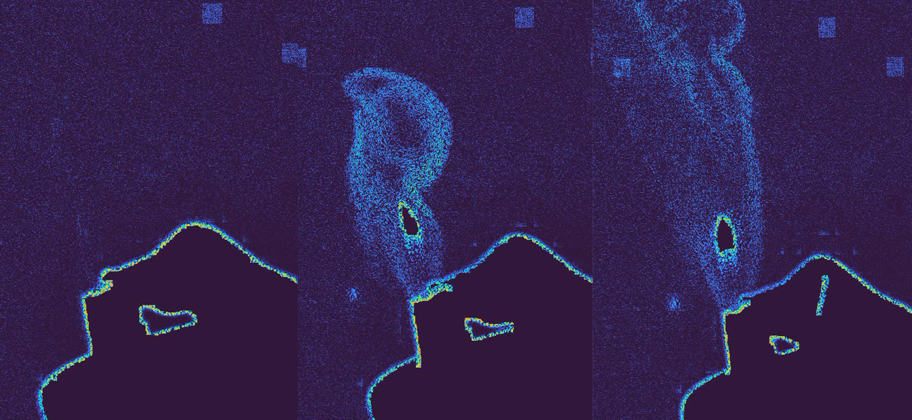
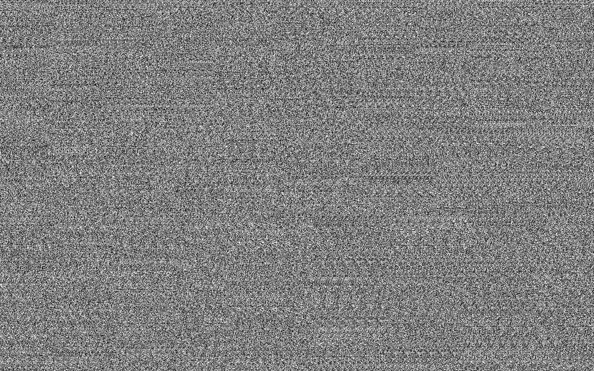

# Fluid Density Analysis through Schlieren Imaging

## Project Overview and Motivation
This repository provides a comprehensive toolkit and theoretical study for visualizing and measuring fluid density variations using Schlieren imaging techniques[cite: 1]. Originally conceptualized by Robert Hooke in 1665 and later popularized by August Toepler, Schlieren imaging acts as a non-intrusive method to observe optical inhomogeneities in transparent media[cite: 1]. 

By exploiting the variations in a fluid's refractive index—caused by changes in temperature, pressure, or chemical composition—this project captures and analyzes phenomena that are otherwise invisible to the naked eye[cite: 1]. A core focus of this repository is analyzing the convective heat flow from a candle using both traditional optical physics and modern Python-based computer vision[cite: 1]. For a complete mathematical and physical breakdown, refer directly to the foundational document: **Analiza densitatii fluidelor prin imagistica Schlieren.pdf**.

## Classic Schlieren System (Analog Approach)
The traditional Schlieren setup is highly sensitive and relies on a physical manipulation of light rays. The system fundamentally consists of four components: a camera, a light source, a spherical mirror, and an obstacle (like a thin wire or blade)[cite: 1].

*   **System Geometry:** The mirror is positioned at a distance equal to its radius of curvature from the camera and light source, defined by the formula $R=2 f$[cite: 1]. 
*   **Hardware Settings:** A high shutter speed (e.g., 1/6000s) and a low ISO are utilized to capture rapid intensity shifts while minimizing sensor noise[cite: 1].
*   **Optical Refraction:** As hot air rises, its density drops according to the ideal gas law approximation $\rho=\frac{M P}{R T}$[cite: 1]. This hot air acts similarly to a thin divergent lens, deflecting light rays. 
*   **Visualization:** Rays that would normally hit the obstacle are deflected into the camera lens, creating bright spots, while rays that would normally enter the lens are blocked, creating shadows[cite: 1].

## Background Oriented Schlieren (BOS) & Digital Processing
To bypass the need for precise, expensive optical mirrors, this project implements Background Oriented Schlieren (BOS) using Python[cite: 1]. This method relies on tracking the distortion of a specific high-contrast background pattern[cite: 1].

The Python image processing pipeline extracts fluid velocity through the following steps:
*   **Reference Comparison:** The software compares current frames against either a fixed reference frame (to see absolute density changes) or adjacent frames (to measure fluid velocity)[cite: 1].
*   **Targeting the Flow:** A narrow Region of Interest (ROI) is selected to isolate the gas column, ensuring the calculated fluctuations are not diluted by empty space[cite: 1].
*   **Velocity Calculation:** The speed of pixel intensity fluctuations is translated into real-world velocity using the frame rate formula $V=v_{f}F_{ps}$[cite: 1].
*   **Algorithmic Enhancements:** The pipeline applies CLAHE (Contrast Limited Adaptive Histogram Equalization) and contour masking to filter out the heat source itself and enhance the visibility of the gas flow[cite: 1].

## Mathematical Verification and Future Scope
To ensure the computer vision outputs are physically accurate, the software's measurements are validated against theoretical thermodynamic models[cite: 1].

The theoretical velocity of the air column at a specific height $z$ above a point heat source is estimated using the Gaussian approximation:
$$u_{c}(z)=C\left[\frac{g\beta Q}{\rho_{0}C_{p}T_{0}}z\right]^{-1/3}$$

At a height of 2cm above the heat source, the theoretical speed is approximately 0.298 m/s[cite: 1]. The Python processing pipeline measured an average speed of ~0.37 m/s, yielding a reasonable experimental error rate of 24.16% given the hardware constraints[cite: 1]. Furthermore, calculating the Reynolds number ($R_{e}=\frac{u_{c}(z)\cdot b(z)}{\mu}$) yields a value of 1324, correctly identifying the flow as transitional (between laminar and turbulent)[cite: 1].

**Future Improvements:**
The current BOS methodology lays the groundwork for advanced applications, such as using Artificial Intelligence for superior background isolation or applying these optical deflection principles ($\epsilon_{x}=\frac{L}{n_{0}}\frac{dn}{dx}$) to astrophysical phenomena like gravitational lensing[cite: 1].

---
*Authors: Stan George-Edward, Radu Sebastian Hristu*
